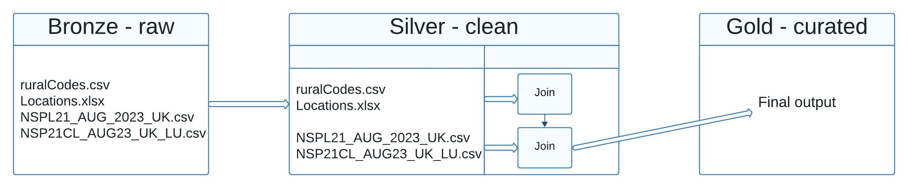

# Data Processing Pipeline

This repository contains Jupyter notebooks that form an end-to-end data processing pipeline, structured into three layers: Bronze, Silver, and Gold.

## Pipeline Architecture

Below is a high-level overview of the data processing pipeline:

## Bronze Layer (`bronze.ipynb`)

The `bronze.ipynb` notebook is responsible for initial data ingestion and preliminary cleaning.

### Key Steps:

- **Initialize Spark**: Set up the Spark session to process the data.
- **Define Schemas**: Specify the schema for each of the source files to ensure data consistency.
- **Read Files**: Load data from CSV and Excel files into Spark DataFrames.
  - NSPL21_AUG_2023_UK.csv and NSP21CL_AUG23_UK_LU.csv files have first 2000 rows of their original files due to GitHub 100 MB file size limitation. Please use original files from their websites.
- **Nulls and Duplicates**: Count and handle null values and duplicates within each column.
- **Clean Post Codes**: Perform specific cleaning operations for columns containing postal codes.
- **Save to Silver Layer**: Persist the cleaned DataFrames to the Silver layer for further processing.

## Silver Layer (`silver.ipynb`)

In the `silver.ipynb` notebook, further transformations and joins are performed on the cleaned data.

### Key Steps:

- **Initialize Spark**: Reinstantiate the Spark session.
- **Read Files**: Bring in the cleaned data from the Bronze layer.
- **Join Tables**: Execute joins on DataFrames to combine data according to business logic.
- **Save Processed Data**: Output the transformed data, ready for the Gold layer.

## Gold Layer (`gold.ipynb`)

The `gold.ipynb` notebook finalizes the data transformation process and prepares data for analysis or reporting.

### Key Steps:

- **Initialize Spark**: Ensure the Spark session is active.
- **Read Table**: Load the processed data from the Silver layer.

### Distribution of Area Names

This bar chart shows the distribution of various area names in the dataset, highlighting how frequently each name appears.

### Unique Organizations per District

This horizontal bar chart represents the number of unique organizations present in each district, providing insights into regional diversity.

## Getting Started

To run these notebooks, you will need an environment capable of executing Jupyter notebooks with Apache Spark. Refer to the installation guides for Apache Spark and Jupyter if you haven't set up your environment.

### Prerequisites

- Apache Spark
- Python
- Jupyter Notebook or JupyterLab
- Required Python libraries (`pyspark`, `pandas`, etc.)

### Installation

1. Clone the repository to your local machine.
2. Ensure you have the prerequisites installed.
3. Launch Jupyter Notebook or JupyterLab.
4. Navigate to the notebook you wish to run and open it.
5. Execute the cells in order to process the data through each layer.

---

## Author

- Mansur Can
